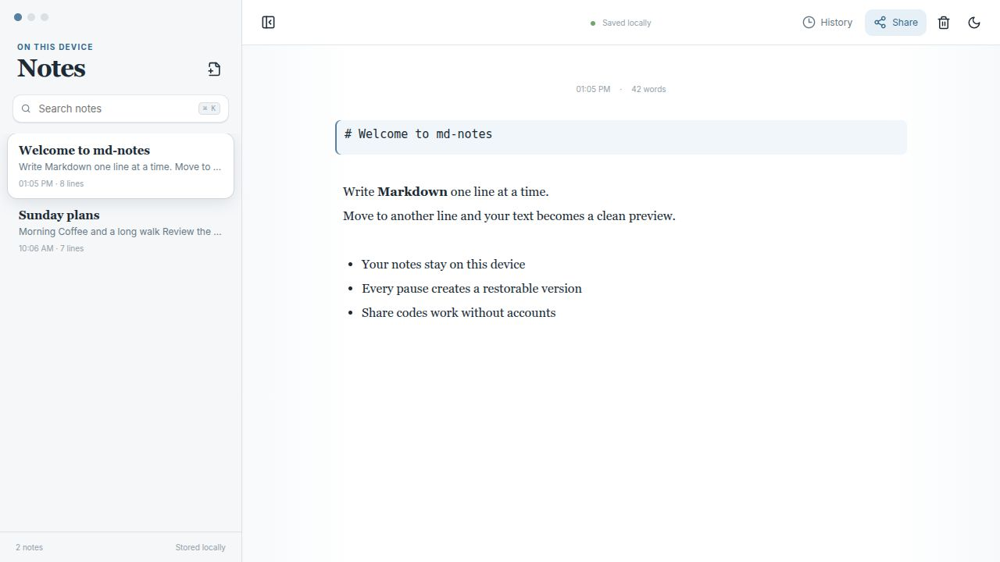
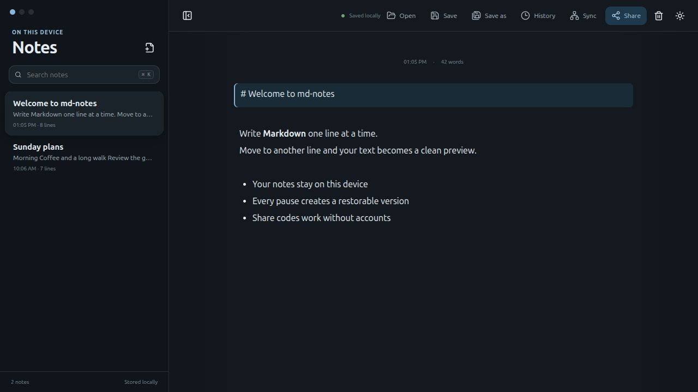
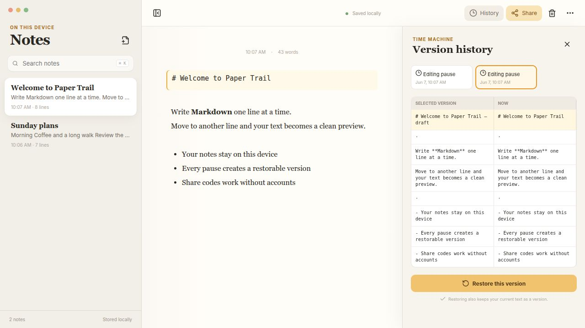
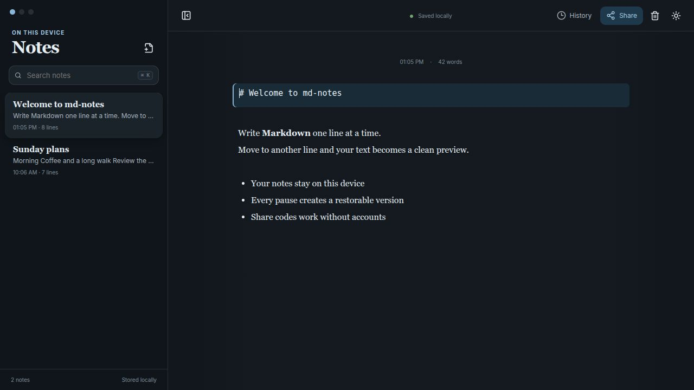
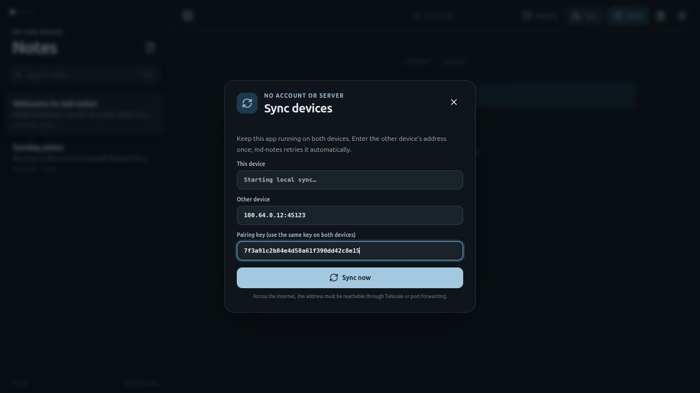
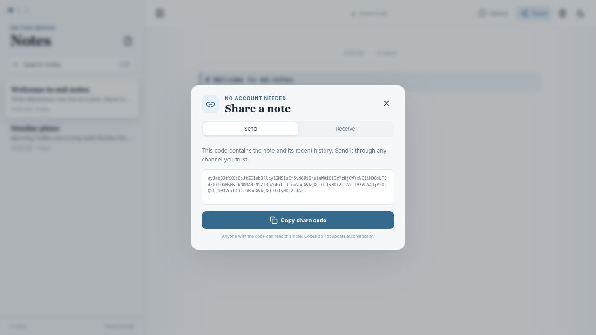

# md-notes

md-notes is a local Markdown notes app for the desktop. Its focused interface lets the editor switch each line between Markdown source and rendered preview.



## MVP Features

- Native desktop app built with Tauri 2
- Line-based Markdown editor with live rendering
- The active line remains editable as Markdown
- Notes list, search, and local storage
- Open, edit, save, and save-as support for ordinary Markdown files
- System-aware light and dark themes with a persistent manual toggle
- Automatic versions after short editing pauses
- Visual comparison and restoration
- Account-free sharing through portable share codes
- Line-by-line conflict resolution when importing changed notes







## Installation

Download the latest installer from the [GitHub Releases page](https://github.com/schmijul/md-notes/releases/latest):

- Ubuntu or Debian: download the `.deb` file and open it, or run `sudo apt install ./md-notes_*.deb`
- Fedora, RHEL, or openSUSE: download and install the `.rpm` file
- Windows: download and run the `.exe` installer
- macOS: download the `.dmg` for Intel or Apple Silicon

No Node.js or Rust installation is required to use the packaged app.

## Development

Requirements:

- Node.js 20 or newer
- Rust 1.77 or newer
- Linux packages required by Tauri and WebKitGTK

On Ubuntu or Debian:

```bash
sudo apt update
sudo apt install libwebkit2gtk-4.1-dev build-essential curl wget file \
  libxdo-dev libssl-dev libayatana-appindicator3-dev librsvg2-dev
```

Install dependencies and start the frontend:

```bash
npm install
npm run dev
```

Start the native desktop app in development mode:

```bash
npm run tauri dev
```

Build Linux production packages (`.deb` and `.rpm`) locally:

```bash
npm run build:desktop
```

Packages are written to `src-tauri/target/release/bundle/`. Build Windows and macOS installers with `npm run tauri build` on the respective operating system.

Creating and pushing a version tag such as `v0.1.0` publishes installers for Linux, Windows, and macOS through GitHub Actions. Keep the tag version aligned with `package.json`, `src-tauri/Cargo.toml`, and `src-tauri/tauri.conf.json`.

Verify the frontend:

```bash
npm test
npm run build
```

## Usage

1. Click a rendered line to edit its Markdown source.
2. Press `Enter` to create a new line. The previous line is rendered immediately.
3. Open **History** to compare and restore earlier versions.
4. Use **Open**, **Save**, or **Save as** to work with ordinary `.md` files in the desktop app.
5. Open **Share** to copy a portable code or import a code you received.

## Peer Synchronization

md-notes can synchronize directly between two running app instances without accounts or a central server:



1. Open **Sync** on both devices.
2. Use the same pairing key on both devices.
3. Enter the other device's shown address and select **Sync now**.
4. Leave the peer address saved; the app retries unreachable peers every 30 seconds.

Both devices keep complete local copies. New notes are added automatically, while differing versions of the same note use the existing line-by-line conflict dialog. Deleted notes are not synchronized yet.

Devices on different networks need a directly reachable address through a private network such as Tailscale or through port forwarding. The pairing key prevents an unknown peer from reading notes, but the built-in protocol does not encrypt its traffic; use an encrypted network such as Tailscale outside a trusted LAN.



## Storage

The app stores its internal notes as JSON in the Tauri WebView's `localStorage` under the key `md-notes-v1`. The exact on-disk WebView storage directory is platform-specific and is managed by the operating system and WebView runtime.

Markdown files opened or saved through the desktop toolbar remain ordinary user-selected `.md` files. The app also keeps its local note copy and version history in `localStorage`. There is no server, account, or telemetry. A share code contains the note text and up to ten recent versions; anyone who has the code can read that data.

## Documentation

- [Architecture](docs/architecture.md)
- [UX and interaction design](docs/ux.md)
- [Versioning and collaboration](docs/versioning-and-collaboration.md)
- [Mobile app status and setup](docs/mobile.md)

## Current Limitations

- Share codes are snapshots; automatic synchronization uses the separate peer connection.
- Peer synchronization requires both devices to be online at the same time and does not propagate deletions yet.
- Real-time LAN collaboration is not included yet.
- Markdown files are opened and saved individually; folder-based note libraries are not included yet.
- The phone layout is implemented, but native Android and iOS packages have not yet been initialized or verified on physical devices.
- AppImage packaging is not part of the verified Linux build; `.deb` and `.rpm` are verified.

These limits keep the first release small and testable. The next practical step is an optional local Tauri data store with import and export, followed by explicitly started LAN sessions.
