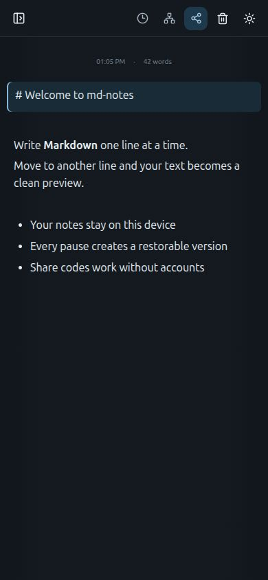
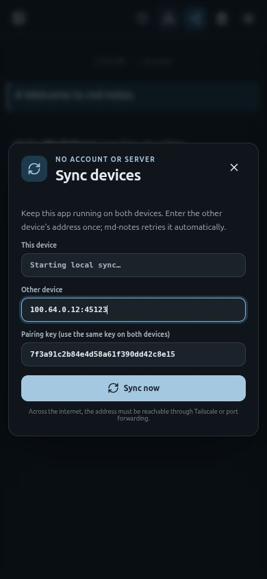

# Mobile App

md-notes uses the same React interface inside Tauri on desktop and mobile. The interface is responsive for phone-sized WebViews: the notes list becomes a drawer, toolbar actions become compact icon buttons, and dialogs fill the available width.





## Current Status

- The shared frontend and Rust code compile on the current desktop target.
- The mobile interface has been verified at a 390 x 844 viewport.
- Android project files have not been generated because this development machine has no Android SDK or NDK configured.
- iOS initialization and builds require macOS with Xcode and cannot be performed on this Linux machine.
- Peer synchronization uses a TCP listener on port `45123`. It still needs verification on physical Android and iOS devices, including platform network permissions and background behavior.

The screenshots show the mobile layout of the shared Tauri UI. They are not screenshots from an Android emulator or an iPhone build.

## Android Setup

Install Android Studio, the Android SDK, NDK, and the Rust Android targets required by Tauri. Then initialize and run the mobile target:

```bash
npm run tauri android init
npm run tauri android dev
```

Build installable Android packages with:

```bash
npm run tauri android build
```

## iOS Setup

On macOS, install Xcode and the required Rust Apple targets. Initialize and run the iOS project using the Tauri CLI available on that machine:

```bash
npm run tauri ios init
npm run tauri ios dev
```

## Mobile Sync Flow

1. Open **Sync** on both devices.
2. Enter the same pairing key on both devices.
3. Enter the reachable address of the other device.
4. Keep both apps open during the exchange.

Mobile operating systems may suspend the listener when the app enters the background. The current design therefore treats foreground-to-foreground synchronization as the supported mobile flow.
